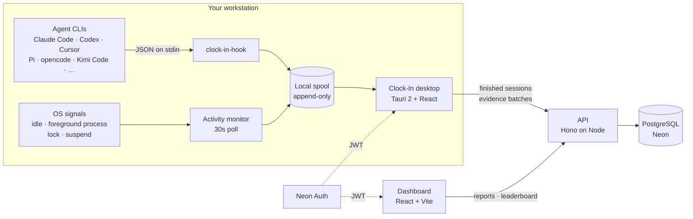

<div align="center">
  

  <h1>Clock-In</h1>

  <p><strong>A time tracker with no timer.</strong><br>
  Keep working. Clock-In records the hours from what your machine and your AI coding agents
  are actually doing, files them under a project, and shows you exactly what it recorded.</p>

  <p>
    <a href="https://github.com/fpresta0607/Clock-In/actions/workflows/ci.yml"></a>
    
    
    
  </p>
</div>

---

## Why this exists

Most timers record a claim: *"I worked four hours on Project X."* Nothing behind it. So the
numbers get padded, everyone quietly knows it, and the report stops meaning anything. Timers
also have to be remembered, which is the other half of why their numbers are wrong.

Clock-In has no timer to remember. Turn recording on once, and the machine's own activity
decides the hours:

- **OS activity.** A slow, read-only monitor folds the machine's state into coarse segments
  (`active`, `idle`, `locked`, `suspended`). No hooks, no injection, no keystrokes. Those
  boundaries are the sessions.
- **Agent sessions.** Claude Code, Codex, and Cursor fire true lifecycle hooks into a tiny local
  spool; Pi and opencode fire theirs from a small extension. A session's working directory
  resolves to a project, so an hour on the leaderboard can name *what* produced it, and the
  runtime is recorded beside the model it was driving without either being read off the other.
  Which runtimes Clock-In knows by name is a roster, not a schema: see
  [**Agent hooks**](#agent-hooks).

Reports then split every total into **attributed** and **unattributed** seconds: hours
something named a project for, and hours that fell to the account's default project because
nothing did. Neither is hidden or penalized. That's the posture: guessing isn't prevented,
it's labelled.

The other half of the deal is that the tracked person sees everything the manager sees.
`GET /me/stats` runs the same attribution math as the org report, and
the desktop app has a "what's recorded" panel. Tracking you can interrogate is a tool;
tracking you can't is surveillance.

## Architecture



The spool is the load-bearing idea, and there are three of them: activity segments, agent
events, and finished sessions. `clock-in-hook` holds no credentials and opens no sockets — it
appends one line under an interprocess lock and exits, so a hook can never slow down or block
the agent CLI, and events recorded while the desktop app is closed survive until it next runs.
Uploads are idempotent on client-generated ids, so a crash mid-upload replays instead of
losing or duplicating evidence.

## How session tracking works

Nobody starts anything. While the desktop app is running and recording is on,
Clock-In writes down the hours you spend at the machine and files them under a
project. The consent toggle is the only on/off the product has.

### Sessions are decided by the machine, not by a person

The monitor already folds the OS into coarse spans (`active`, `idle`, `locked`,
`suspended`). Those spans are now the session boundaries. A session opens on the
first active span, and closes when:

- the machine goes quiet for longer than the **quiet-time limit** (10 minutes by default),
- the screen locks,
- the machine suspends,
- the attributed project changes, or
- the app quits.

It always closes at the **last active moment**, never at "now", so an unattended
tail is never recorded. Quiet gaps shorter than the limit stay inside the session
and are reported as trimmed idle, which the server subtracts from the duration:
a workday is a handful of sessions, not one row per interruption. An open agent
session holds a session through quiet time and lock, because an overnight agent
run is unattended work rather than an abandoned desk.

The open session is written to disk on every 30-second tick. A crash or a forced
shutdown therefore costs the seconds since the last tick, and the next launch
closes the carried session at its last active moment rather than resuming across
a gap nothing can vouch for.

### Where the hours land

Every session belongs to exactly one project, resolved in this order:

1. **The project the person pinned.** The desktop app's picker is an override, not a start button.
2. **The folder an agent is working in.** Agent CLIs report their working directory; `resolveProjectForCwd` matches it against the user's path mappings by normalized longest prefix on path-segment boundaries, so `c:/dev/clock` matches `c:/dev/clock/src` but never `c:/dev/clock-in-extra`.
3. **The default project**, which is the oldest project on the account. Every new workspace
   already starts with `General`, so there is always somewhere for the time to go.

The project cannot change under an open session: when the answer changes, the
session closes at its last active moment and the next one picks up there. No
second of work is dropped or counted twice.

### Attributed and unattributed

`time_sessions.attribution` records which of those answers applied, and reporting
reads it directly:

| Attribution | What it means | Counts as |
|---|---|---|
| `agent` | an agent's working directory named the project | attributed |
| `selected` | the person picked the project | attributed |
| `default` | nothing named a project, so it fell to the default | **unattributed** |
| `manual` | a legacy row from the retired start/stop timer | attributed |

A session is attributed whole or not at all, so `attributedSeconds +
unattributedSeconds` always equals `durationSeconds`. Unattributed hours are not
penalized or hidden; they are labelled, so a project total nobody vouched for
reads differently from one that something did. `GET /reports`,
`/reports/leaderboard`, `/me/stats`, and the CSV export all carry both figures.

**Legacy rows are untouched.** Every session recorded by the old manual timer
keeps its data and is marked `manual`. The `POST /sessions`, `/sessions/:id/stop`,
and `/sessions/current` routes still work, deprecated, so an installed older
build can finish and upload work it already started; no shipped client calls them.

### How the evidence reaches the server

Three local spools, one discipline. Each is append-only, drained in two phases
(read, then truncate only what the server acknowledged), and idempotent on a
client-generated id, so a crash mid-upload replays rather than losing or
duplicating anything.

| Spool | Written by | Uploaded to |
|---|---|---|
| activity segments | the 30-second monitor tick | `POST /activity/segments` |
| agent events | `clock-in-hook`, one line per lifecycle event | `POST /agent-sessions` |
| finished sessions | the session tracker, as each one closes | `POST /sessions/observed` |

`clock-in-hook` is the reason agent evidence survives everything: agent CLIs run
it from their lifecycle hooks, it appends one line under an interprocess lock (an
advisory `File::try_lock` on a sibling `.lock` sentinel, so a holder that dies
mid-append releases it) and exits. It holds no credentials and opens no sockets,
so a hook can never slow down or block the CLI, and events recorded while the
desktop app is closed wait on disk until it next runs.

Uploads run every five minutes in batches of up to 500. A session older than the
**seven-day** freshness bound is refused rather than backfilled, and per-row
refusals never fail a batch.

### The OS monitor, in detail

One task wakes every **30 seconds** and asks Windows two read-only questions:
seconds since the last input (`GetLastInputInfo`) and the process name behind the
foreground window (`GetForegroundWindow` then `QueryFullProcessImageNameW`). The
**name only**, never the title. Lock and suspend arrive as broadcasts on a hidden
window (`WM_WTSSESSION_CHANGE`/`WTS_SESSION_LOCK`,
`WM_POWERBROADCAST`/`PBT_APMSUSPEND`); unlock and resume raise no event, because
the next poll closes the span down the same code path.

There are no input hooks, no injection, and no per-keystroke cost. Everything
above the `platform` module is pure logic over an injected clock, so the Win32
calls never run under test.

The **phase-3 precision work** (event-driven foreground changes, UWP process
resolution, clock-gap sleep detection, session-disconnect handling) is designed in
[the phase 3 design](docs/plans/2026-08-09-phase-3-design.md) and is **not on this
branch**. Today the 30-second poll is the only source of per-app boundaries,
Store-packaged apps report as `ApplicationFrameHost.exe`, and Modern Standby sleep
that never fires `PBT_APMSUSPEND` reads as idle rather than suspended.

### The symmetry rule

`GET /me/stats` runs the same attribution math over the same completed-session set
as the organization report. The desktop app's **What
Clock-In is recording** panel (the recording line on the main screen, or *See
exactly what's recorded* in settings) shows live recording state, which evidence
sources are switched on, and the collected and never-collected lists below, in the
same words the dashboard's **How Clock-In works** dialog uses. The person being
tracked sees the same math, and the same explanation, as the person reading the
report.

### What is never collected

Not by policy, but because the code never reads it:

- **Keystrokes and mouse input.** The monitor asks *how long since* the last input, never what it
  was. There are no input hooks anywhere in the codebase.
- **Screenshots**, of any kind.
- **Window titles.** The foreground query returns a process name and stops there.
- **Input content.** Clock-In never records anything typed into a form, chat, or document.
- **URLs, browsing history, or page content.** Nothing in the product talks to a browser.
- **Document names, file contents, message or email bodies.**
- **Injection.** Clock-In never reaches inside or controls another app. The monitor is read-only
  Win32 queries plus broadcasts delivered to Clock-In's own hidden window.

What *is* collected: coarse activity segments with timestamps, the foreground process name, agent
session boundaries with their working directory, and the start and end of each session the monitor
observed. A working directory can contain a user name, so it is shown only to the owning user and
org admins, and is redacted from logs.

## Repository layout

A pnpm workspace. Contracts flow down; nothing flows back up.

| Package | What lives there |
|---|---|
| **`packages/shared`** | Zod contracts shared by every client and the API, invite-code and duration helpers, and the SIQstack brand stylesheet both frontends import. |
| **`packages/database`** | Drizzle schema, SQL migrations, the connection factory, and the migration runner. |
| **`apps/api`** | Hono API: env validation, Neon Auth JWT verification, services (sessions, activity, agent sessions, attribution, reports), Drizzle repositories, CSV export. |
| **`apps/desktop`** | The tray app. React UI over a Tauri 2 Rust host: `monitor.rs` (activity), `spool.rs` (shared with the hook binary), `uploader.rs`, `recovery.rs`, and the `clock-in-hook` bin target. |
| **`apps/web`** | The dashboard: sign-up/sign-in, clickable team leaderboard with per-member breakdowns, installer downloads. |

Routes stay thin, services own the rules, repositories own SQL. Every service is tested
against explicit fakes, so the behavior suite needs no database.

## Quick start

**Prerequisites**

- Node **22+** and pnpm **10.14+** (`corepack enable`)
- A PostgreSQL database with **Neon Auth** configured — the API verifies JWTs against its JWKS
- For the desktop app: Rust **1.89+** (`File::try_lock`, used by the spool) plus Tauri's system
  dependencies. On Debian/Ubuntu: `libwebkit2gtk-4.1-dev libappindicator3-dev librsvg2-dev patchelf libssl-dev`

**Set up**

```bash
pnpm install
cp .env.example .env          # fill in DATABASE_URL and AUTH_BASE_URL

# The migration runner reads the environment directly rather than loading .env:
DATABASE_URL='postgresql://…' pnpm --filter @clock-in/database migrate
```

**Run**

```bash
PORT=3977 pnpm --filter @clock-in/api dev      # API      → http://localhost:3977
pnpm --filter @clock-in/web dev                # dashboard → http://localhost:5180
pnpm --filter @clock-in/desktop tauri dev      # desktop app (Vite on :1420 in the Tauri shell)
```

> **On ports.** The API defaults to `PORT=3000`, but both clients default to
> `http://localhost:3977` in development — the desktop's fallback is compiled in. Run the API
> on `3977` (as above) or point `VITE_API_BASE_URL` and `CLOCK_IN_API_URL` at `3000`.

**When environment variables are read** — this trips people up:

| Variable | Consumer | Read at |
|---|---|---|
| `DATABASE_URL`, `AUTH_BASE_URL`, `PORT`, `CORS_ORIGINS`, `NODE_ENV` | API | **runtime** |
| `VITE_AUTH_BASE_URL`, `VITE_API_BASE_URL` | web | **build** time, baked into the bundle |
| `CLOCK_IN_AUTH_URL`, `CLOCK_IN_API_URL` | desktop | **compile** time (`option_env!`) |

A release desktop build without the last two **fails the build** rather than shipping an
installer that quietly points at localhost (`src-tauri/build.rs`).

## Commands

Run from the repository root.

| Command | What it does |
|---|---|
| `pnpm typecheck` | `tsc --noEmit` across every package |
| `pnpm test` | the full Vitest suite (services, routes, contracts, React) |
| `pnpm build` | production build of every package |
| `DATABASE_URL=… pnpm --filter @clock-in/database migrate` | apply migrations |
| `pnpm --filter @clock-in/database test:integration` | PostgreSQL migration tests; needs `TEST_DATABASE_URL` |
| `pnpm --filter @clock-in/desktop tauri build` | build desktop installers |
| `cargo test --manifest-path apps/desktop/src-tauri/Cargo.toml` | the Rust suite |
| `cargo clippy --manifest-path apps/desktop/src-tauri/Cargo.toml --all-targets -- -D warnings` | Rust lints, as CI runs them |

CI runs typecheck → test → build → `docker build` on the API image, plus Rust
fmt/clippy/test, on every push and pull request.

## The API

Everything except `/health` requires `Authorization: Bearer <Neon Auth JWT>`; the user and
organization are derived from verified claims, never from the request body.

| Method | Path | Purpose |
|---|---|---|
| `GET` | `/health` | liveness probe |
| `POST` | `/accounts` | first call after sign-up: create a workspace, or join one by invite code |
| `GET` | `/me` | the signed-in user |
| `GET` | `/organization` | workspace name and invite code |
| `POST` | `/organization/join` | move an account into another workspace |
| `GET` | `/projects` | projects the caller belongs to |
| `POST` | `/sessions/observed` | batch upload of finished sessions, idempotent on the client-generated `clientId` |
| `POST` | `/sessions`, `/sessions/:id/stop`, `GET /sessions/current` | **deprecated** manual timer; kept so older installed builds can finish their work |
| `POST` | `/activity/segments` | batch upload of activity segments |
| `POST` | `/agent-sessions` | batch upload of agent lifecycle events |
| `GET` `POST` `PATCH` `DELETE` | `/path-mappings`, `/path-mappings/:id` | map a path prefix to a project |
| `GET` | `/reports`, `/reports/leaderboard`, `/reports/export.csv` | organization reporting |
| `GET` | `/me/stats` | the caller's totals per project and per app; an optional `?userId=` opens a teammate's |

**Invariants the server enforces**, not the client: a session must end after it starts and
not in the future; it must start inside the 7-day freshness window; its idle seconds cannot
exceed its elapsed time; sessions past 12 hours are flagged `needs_review`; and a session's
project must be one the user is a member of (a composite foreign key, so it can't be
bypassed). A bad row in a batch is rejected on its own and named in the response; the rest of
the batch still lands.

**Attributed seconds** are a session's whole duration when its `attribution` is anything but
`default`, and zero when it is. History can't be backfilled: a session that arrives more than
7 days after it started is refused outright.

## Agent hooks

At startup, Clock-In auto-discovers which agent CLIs are installed (by checking for their
config directories) and silently wires up every one whose hook shape it knows how to merge:
today Claude Code, Codex, and Cursor. Where a config can be merged safely it is, with a
backup and an atomic write; where it can't (Kimi Code, Pi, opencode, Grok, Muse, GitHub
Copilot), the "what's switched on" panel carries the exact snippet to paste. A runtime that
is not installed on this machine reports as absent rather than offering a button that cannot
work.

### The roster is not an allowlist

`packages/shared/src/agent-runtimes.json` is the one place a runtime is declared, and both the
TypeScript side and the Rust host read that same file. It decides what Clock-In can *say* about
a runtime — its display name, its executables, where its hooks live, the snippet to paste — and
never whether a runtime may be recorded. `agent_sessions.source` is text with a shape check
rather than an enum, so a CLI nobody has declared yet is stored under its own id instead of
being rejected or collapsed into `other`. Supporting a new runtime properly is a roster entry;
recording one at all needs nothing.

A runtime is also never inferred from its model, nor a model from its runtime: `pi` driving
`deepseek-v4-pro` is the `pi` runtime, `agent_sessions.model` says what it was driving, and a
hook that names no model records none rather than a guess.

| CLI | Config | Signal quality | Registration |
|---|---|---|---|
| **Claude Code** | `~/.claude/settings.json` | true session boundaries (`SessionStart`/`SessionEnd`); `PostToolUse` heartbeats available with manual config | merged automatically |
| **Codex** | `~/.codex/hooks.json` | true boundaries; same hook shape as Claude Code, told apart by the `--source` its registration passes | merged automatically |
| **Cursor** | `~/.cursor/hooks.json` | true boundaries, IDE only — cloud agents never fire them | merged automatically |
| **Pi** / **pi-signed** | `~/.pi/agent/extensions/` | true boundaries (`session_start`/`session_shutdown`); reports its model | extension to paste |
| **opencode** | `~/.config/opencode/plugins/` | start is a true boundary; no end event, so `session.idle` heartbeats and gaps close it | plugin to paste |
| **Kimi Code**, **Grok**, **Muse**, **GitHub Copilot** | per the roster | hook mechanism unconfirmed against any installed version | snippet to paste |
| anything else | — | call `clock-in-hook --source <runtime> --event …` yourself | manual |

Runtimes are listed whether or not they are installed, so a machine that later grows one lights
it up without a code change. Every runtime in the roster has a mark in the UI: opencode uses
its genuine MIT-licensed logo, and the other nine carry original monochrome glyphs drawn for
Clock-In on one coherent grid. Those are deliberately *not* imitations of anyone's brand asset
(which cannot be redistributed in a third-party app); they are Clock-In's own marks naming a
runtime inside its own UI, and need no licence from anyone.

Because `session-end` is never guaranteed (a crash, a `kill -9`), the server reaps agent
sessions with no event for 6 hours and closes them at their last-seen timestamp. An `end` that
arrives before its `start` is tolerated by upsert, not rejected.

## Privacy

The posture is deliberate, and it is the same in the code as it is here. The collected and
never-collected lists live in
[**What is never collected**](#what-is-never-collected) above; this section is the policy around
them.

- Recording is **on by default** for a new install and gated behind one setting, which is the
  only on/off in the product; disabling it aborts the tasks, so a stopped recorder records
  nothing and no hours accrue at all.
- Switching recording off closes the open session first, so the work already done is kept
  rather than discarded, and earlier hours stay exactly where they are.
- The desktop app's **What Clock-In is recording** panel states, live, what is switched on and
  what is being collected, and offers the one button that changes it.
- A working directory can contain a user name, so it's shown only to the owning user and org
  admins, and redacted from logs like session descriptions are.
- `clock-in-hook` holds no credentials and opens no sockets. The spool file is its entire
  interface.
- The desktop app never persists the session token: Rust keeps it in the OS credential store,
  and the webview never sees it.

Deploying this on employees' machines is a decision with legal weight that varies by
jurisdiction. Disclosure and consent are the deploying company's obligation, not the
software's.

## Testing

Behavior first, plumbing second:

- **Services and routes** are tested against explicit repository fakes: authorization,
  session validation, idempotent replay, attribution ties, staleness reaping, and the
  attributed/unattributed split. No database required.
- **PostgreSQL integration tests** cover migrations and database-level invariants, and skip
  cleanly unless `TEST_DATABASE_URL` points at a disposable branch. Never point them at production.
- **React Testing Library** covers the recording card, the project override, the stats views,
  and every state of the "what's recorded" panel.
- **Rust tests** are pure: the clock and the activity source are injected as traits, so the
  Win32 calls never run under test. The session tracker is driven tick by tick, exactly as the
  poll task drives it.

`pnpm test` and the Rust suite are the gate; a manual GUI checklist lives at the end of
[`docs/plans/2026-08-07-phase-2-implementation.md`](docs/plans/2026-08-07-phase-2-implementation.md)
for what automation can't click.

## Deploying

The API runs on Railway from `apps/api/Dockerfile`, the dashboard on Vercel, and desktop
installers are published to GitHub Releases by tagging (`git tag v0.1.0 && git push origin v0.1.0`).
Full runbook, DNS records, and rollback steps: **[DEPLOY.md](DEPLOY.md)**.

## Design notes

The design documents are the reasoning behind the code — including the alternatives that were
rejected and why.

- [Phase 1 design](docs/plans/2026-08-06-phase-1-design.md) — the manual timer, its data model, and its guardrails (the timer it describes has since been retired)
- [Phase 2 design](docs/plans/2026-08-07-phase-2-design.md) — evidence, attribution, and the anti-manipulation stance
- [Phase 3 design](docs/plans/2026-08-09-phase-3-design.md): browser attribution, monitor precision, and the grandmother test (designed, not built)
- [Phase 1](docs/plans/2026-08-06-phase-1-implementation.md) · [Phase 2](docs/plans/2026-08-07-phase-2-implementation.md) · [Phase 3](docs/plans/2026-08-09-phase-3-implementation.md) implementation plans

## Status and known gaps

Recording is automatic; phase 3 is designed and not started. What's deliberately not built
yet:

- **Recording is Windows-only.** The `ActivitySource` trait admits macOS and Linux
  implementations, and without one there are no session boundaries to record. Installers are
  built for Windows and macOS today, but a macOS install records nothing until that lands.
- **Nothing but an agent names a project by itself.** A foreground process name proves the
  machine was working, not what it was working on, so time with no agent and no pinned project
  lands in the default project and reads as unattributed.
- **One project at a time.** Concurrent agent sessions in different projects do not split a
  session; the last one to report wins, and the boundary between them is a session close.
- **No signing credentials yet** — paid certificates are needed for a real release (see
  DEPLOY.md). Until they arrive, the **Unsigned test installers** workflow is the
  distributable: it republishes the `unsigned-latest` prerelease under fixed asset names,
  which is what the dashboard's **Download for Windows** button links. Windows SmartScreen
  warns, macOS needs `xattr`. Windows debug builds carry the auto-updater
  (see DEPLOY.md); macOS updates are still by hand.
- Evidence can be forged by a determined user. Automatic recording raises the cost and the
  visibility of padding; it does not attempt cryptographic proof.

---

<div align="center">
<sub>No license file is present, so the default applies: all rights reserved.</sub>
</div>
