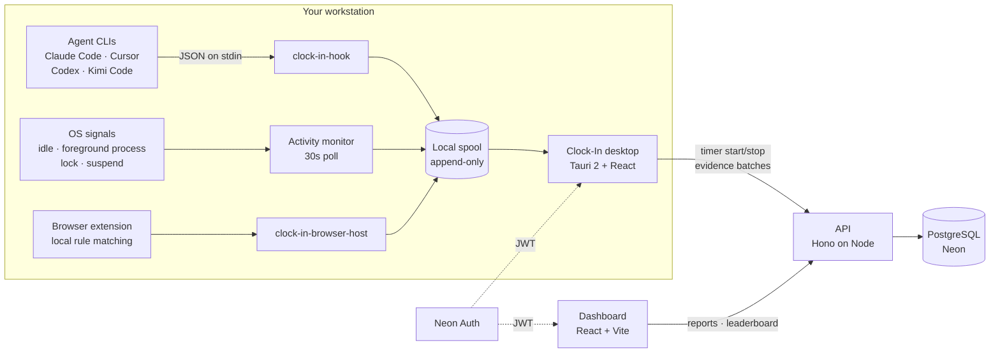

<div align="center">
  

  <h1>Clock-In</h1>

  <p><strong>A time tracker whose hours carry evidence.</strong><br>
  Start a timer, keep working. Clock-In corroborates that time against what your machine
  and your AI coding agents were actually doing — and shows you exactly what it recorded.</p>

  <p>
    <a href="https://github.com/fpresta0607/Clock-In/actions/workflows/ci.yml"></a>
    
    
    
  </p>
</div>

---

## Why this exists

Most timers record a claim: *"I worked four hours on Project X."* Nothing behind it. So the
numbers get padded, everyone quietly knows it, and the report stops meaning anything.

Clock-In keeps the manual timer — a human still decides when work starts — but records
**evidence beside every session** and computes how much of that time is backed by it:

- **OS activity.** A slow, read-only monitor folds the machine's state into coarse segments
  (`active`, `idle`, `locked`, `suspended`). No hooks, no injection, no keystrokes.
- **Browser attribution.** An optional browser extension matches active tabs against the
  user's rules locally, so mapped browser work can be attributed to a project without
  sending browsing data to the server. Its privacy and protocol contract lives in the
  [extension guide](apps/browser-extension/README.md).
- **Agent sessions.** Claude Code, Cursor, Codex, and Kimi Code fire lifecycle hooks into a
  tiny binary that spools them locally. A session's working directory resolves to a project,
  so an hour on the leaderboard can name *what* produced it.

The desktop's Today activity card can also show a small dial beside recognized agent CLI
activity: how much of that tool's plan is left, read from the machine's local quota
information. The figure describes the account signed in to that provider **right now**, not
the one that recorded the row beside it, and the dial says so when you open it. Anything
unreadable, such as missing quota tooling, a signed-out provider, or a locked state file,
reads as an explicit unknown rather than an error.

Reports then split every total into **corroborated** and **uncorroborated** seconds. Manual
time still counts — it just reads differently next to verified time. That's the whole posture:
padding isn't blocked, it's visible.

The other half of the deal is that the tracked person sees everything the manager sees.
`GET /me/stats` runs the same corroboration math as the org report, scoped to the caller, and
the desktop app has a "what's recorded" panel. Tracking you can interrogate is a tool;
tracking you can't is surveillance.

## Architecture



The spool is the load-bearing idea. `clock-in-hook` holds no credentials and opens no
sockets — it appends one line under an interprocess lock and exits, so a hook can never slow
down or block the agent CLI, and events recorded while the desktop app is closed survive
until it next runs. Uploads are idempotent on client-generated ids, so a crash mid-upload
replays instead of losing or duplicating evidence.

## How session tracking works

Every hour Clock-In reports is two separate things, kept apart on purpose:

| | Who starts it | What it means |
|---|---|---|
| **The claim** | a human presses **Start** | "I say I worked from here to here." |
| **The evidence** | nobody: it runs by itself | "here is what this machine was doing during that window." |

The evidence never becomes the claim. It is recorded beside it, and the report shows how much of
the claim it backs.

### The claim: the manual timer

You pick a project and press start; you press stop when you are done. Nothing starts a timer for
you. `POST /sessions` is idempotent on a client-generated `clientId`, so a retry after a dropped
connection replays instead of double-counting, and the server (not the client) enforces one
running timer per user, a 7-day backdating limit, no stops in the future, and a `needs_review`
flag past 12 hours.

Two automatic **stops** exist, both configurable and both visible in settings: locking the screen
(`Stop the timer when the machine locks`, on by default) and staying away past the hard limit
(60 minutes by default). Both stop the session at the last-active boundary rather than at "now",
so the unattended tail is never billed. An open agent session suppresses both while *Count active
agent sessions as work while away* is on (the default): an overnight agent run is unattended work,
not an abandoned desk. Measured idle inside a session is trimmed at stop; answering the away
prompt with **Keep** holds that one away span billable and trims the rest.

### The evidence: two streams that run themselves

Neither stream has a start button. While the desktop app is running and recording is on
(`MonitorSettings.enabled`, **on by default**), both collect continuously, whether or not a timer
is running. Turning recording off aborts the tasks, so a stopped recorder records nothing, and it
never blocks the timer: that time simply arrives uncorroborated.

**1. OS activity** (`apps/desktop/src-tauri/src/monitor.rs`)

One task wakes every **30 seconds** and asks Windows two read-only questions: seconds since the
last input (`GetLastInputInfo`) and the process name behind the foreground window
(`GetForegroundWindow` then `QueryFullProcessImageNameW`). The **name only**, never the title.
Lock and suspend do not need polling: they arrive as broadcasts on a hidden window
(`WM_WTSSESSION_CHANGE`/`WTS_SESSION_LOCK`, `WM_POWERBROADCAST`/`PBT_APMSUSPEND`). Unlock and
resume deliberately raise no event, because the next poll closes the span down the same code path.

The signal stream folds into transition-based segments (`active`, `idle`, `locked`, `suspended`):
repeats coalesce, so a workday is dozens of rows rather than thousands of ticks, and an `idle`
signal backdates the transition to when input actually stopped rather than when the poll noticed.
Closed segments append to a local spool immediately and upload in batches of up to 500 every five
minutes. There are no input hooks, no injection, and no per-keystroke cost; everything above the
`platform` module is pure logic over an injected clock, so the Win32 calls never run under test.

The **phase-3 precision work** (event-driven foreground changes, UWP process resolution,
clock-gap sleep detection, session-disconnect handling) is designed in
[the phase 3 design](docs/plans/2026-08-09-phase-3-design.md) and is **not on this branch**.
Today the 30-second poll is the only source of per-app boundaries, Store-packaged apps report as
`ApplicationFrameHost.exe`, and Modern Standby sleep that never fires `PBT_APMSUSPEND` reads as
idle rather than suspended.

**2. Agent sessions** (`clock-in-hook`, `spool.rs`)

Claude Code, Cursor, Codex, and Kimi Code fire lifecycle hooks that run `clock-in-hook`. It reads
one JSON event from stdin (or the equivalent flags), appends **one line** to the local append-only
spool under an interprocess lock (an advisory `File::try_lock` on a sibling `.lock` sentinel, so a
holder that dies mid-append releases it), and exits. It holds no credentials and opens no sockets:
the spool file is its entire interface, so a hook can never slow down or block the agent CLI, and
events recorded while the desktop app is closed wait on disk until it next runs.

The desktop drains that spool in two phases, truncating only what the server acknowledged, and
every event upserts on `(organization, user, source, external session id)`. A crash mid-upload
therefore replays rather than losing or duplicating evidence. Because `session-end` is never
guaranteed (a crash, a `kill -9`), the server reaps agent sessions with no event for six hours and
closes them at their last-seen timestamp.

### Grouping and attribution

Each agent event carries the **working directory** the CLI ran in. `resolveProjectForCwd` matches
it against the user's path mappings by normalized longest prefix on path-segment boundaries, so
`c:/dev/clock` matches `c:/dev/clock/src` but never `c:/dev/clock-in-extra`; equal-length ties
resolve only when every winner names the same project, and are otherwise left unattributed.
Attribution is server-authoritative. The desktop caches mappings to raise a local suggested-start
prompt, but the stored mapping row is what the report reads.

Time then rolls up **session → project → user → organization**: `GET /reports` lists sessions,
`/reports/leaderboard` totals per member, and `/me/stats` totals the caller's own time per project
and per foreground app. No token, cost, or model-usage statistics are collected on this branch:
an agent event is a source, a session id, a lifecycle kind, a timestamp, and a working directory,
and nothing else. Non-agent activity carries no project either, because a foreground process name
proves the machine was working, not which project it was working on.

**Browser attribution** is designed (the browser evaluates rules locally and reports only "rule N
matched from here to here", never URLs or titles) and is **not built on this branch**. Nothing in
the product reads your browser today.

### Corroborated and uncorroborated time

For one session, corroborated seconds are the overlap of `[startedAt, stoppedAt]` with the union
of the member's fresh `active` segments and the agent sessions linked to that timer, floored and
capped at `durationSeconds`. Evidence that arrives **more than seven days** after it occurred is
stored but never corroborates, so history cannot be backfilled after the fact. Overlapping
evidence intervals are summed rather than unioned and the cap absorbs the double count, so
corroborated time can never exceed the session it backs.

Uncorroborated time is never blocked, deleted, or penalized. It counts as hours. It just reads
differently beside verified time, which is the entire posture: padding is not prevented, it is
visible.

### The symmetry rule

`GET /me/stats` runs the same corroboration SQL over the same completed-session set as the
organization report, scoped to the caller. The desktop app's **What Clock-In is recording** panel
(the recording line on the main screen, or *See exactly what's recorded* in settings) shows live
recording state, which evidence sources are switched on, and the collected and never-collected
lists below, in the same words the dashboard's **How Clock-In works** dialog uses. The person
being tracked sees the same math, and the same explanation, as the person reading the report.

### What is never collected

Not by policy, but because the code never reads it:

- **Keystrokes and mouse input.** The monitor asks *how long since* the last input, never what it
  was. There are no input hooks anywhere in the codebase.
- **Screenshots**, of any kind.
- **Window titles.** The foreground query returns a process name and stops there.
- **URLs, browsing history, or page content.** Nothing in the product talks to a browser.
- **Document names, file contents, message or email bodies.**
- **Anything injected into another process.** The monitor is read-only Win32 queries plus
  broadcasts delivered to Clock-In's own hidden window.

What *is* collected: coarse activity segments with timestamps, the foreground process name, agent
session boundaries with their working directory, and your own timer start and stop times. A
working directory can contain a user name, so it is shown only to the owning user and org admins,
and is redacted from logs.

## Repository layout

A pnpm workspace. Contracts flow down; nothing flows back up.

| Package | What lives there |
|---|---|
| **`packages/shared`** | Zod contracts shared by every client and the API, invite-code and duration helpers, and the SIQstack brand stylesheet both frontends import. |
| **`packages/database`** | Drizzle schema, SQL migrations, the connection factory, and the migration runner. |
| **`apps/api`** | Hono API: env validation, Neon Auth JWT verification, services (sessions, activity, agent sessions, attribution, reports), Drizzle repositories, CSV export. |
| **`apps/desktop`** | The tray app. React UI over a Tauri 2 Rust host: `monitor.rs` (activity, browser registration, and browser-spool drain), `quota.rs` (agent plan headroom), `spool.rs` (shared by both helper binaries), `uploader.rs`, `recovery.rs`, `clock-in-hook`, and `clock-in-browser-host`. |
| **`apps/browser-extension`** | The Manifest V3 extension for Chrome, Edge, and Firefox variants. It matches URL rules locally and sends verdict-only browser spans through the native host. |
| **`apps/web`** | The dashboard: sign-up/sign-in, team leaderboard, recent sessions, installer downloads. |

Routes stay thin, services own the rules, repositories own SQL. Every service is tested
against explicit fakes, so the behavior suite needs no database.

## Quick start

**Prerequisites**

- Node **22+** and pnpm **10.14+** (`corepack enable`)
- A PostgreSQL database with **Neon Auth** configured — the API verifies JWTs against its JWKS
- For the desktop app: Rust **1.89+** (`File::try_lock`, used by the spool) plus Tauri's system
  dependencies. On Debian/Ubuntu: `libwebkit2gtk-4.1-dev libappindicator3-dev librsvg2-dev patchelf libssl-dev`

**Set up**

```bash
pnpm install
cp .env.example .env          # fill in DATABASE_URL and AUTH_BASE_URL

# The migration runner reads the environment directly rather than loading .env:
DATABASE_URL='postgresql://…' pnpm --filter @clock-in/database migrate
```

**Run**

```bash
PORT=3977 pnpm --filter @clock-in/api dev      # API      → http://localhost:3977
pnpm --filter @clock-in/web dev                # dashboard → http://localhost:5180
pnpm --filter @clock-in/desktop tauri dev      # desktop app (Vite on :1420 in the Tauri shell)
```

> **On ports.** The API defaults to `PORT=3000`, but both clients default to
> `http://localhost:3977` in development — the desktop's fallback is compiled in. Run the API
> on `3977` (as above) or point `VITE_API_BASE_URL` and `CLOCK_IN_API_URL` at `3000`.

**When environment variables are read** — this trips people up:

| Variable | Consumer | Read at |
|---|---|---|
| `DATABASE_URL`, `AUTH_BASE_URL`, `PORT`, `CORS_ORIGINS`, `NODE_ENV` | API | **runtime** |
| `VITE_AUTH_BASE_URL`, `VITE_API_BASE_URL` | web | **build** time, baked into the bundle |
| `CLOCK_IN_AUTH_URL`, `CLOCK_IN_API_URL` | desktop | **compile** time (`option_env!`) |

A release desktop build without the last two **fails the build** rather than shipping an
installer that quietly points at localhost (`src-tauri/build.rs`).

## Commands

Run from the repository root.

| Command | What it does |
|---|---|
| `pnpm typecheck` | `tsc --noEmit` across every package |
| `pnpm test` | the full Vitest suite (services, routes, contracts, React) |
| `pnpm build` | production build of every package |
| `DATABASE_URL=… pnpm --filter @clock-in/database migrate` | apply migrations |
| `pnpm --filter @clock-in/database test:integration` | PostgreSQL migration tests; needs `TEST_DATABASE_URL` |
| `pnpm --filter @clock-in/desktop tauri build` | build desktop installers |
| `cargo test --manifest-path apps/desktop/src-tauri/Cargo.toml` | the Rust suite |
| `cargo clippy --manifest-path apps/desktop/src-tauri/Cargo.toml --all-targets -- -D warnings` | Rust lints, as CI runs them |

CI runs typecheck → test → build → `docker build` on the API image, plus Rust
fmt/clippy/test, on every push and pull request.

## The API

Everything except `/health` requires `Authorization: Bearer <Neon Auth JWT>`; the user and
organization are derived from verified claims, never from the request body.

| Method | Path | Purpose |
|---|---|---|
| `GET` | `/health` | liveness probe |
| `POST` | `/accounts` | first call after sign-up: create a workspace with `General Work`, or join one by invite code |
| `GET` | `/me` | the signed-in user |
| `GET` | `/organization` | workspace name and invite code |
| `POST` | `/organization/join` | move an account into another workspace |
| `GET` `POST` | `/projects` | list the caller's projects or create one |
| `PATCH` `DELETE` | `/projects/:id` | rename or archive a project (workspace admin) |
| `POST` | `/sessions` | start a timer — idempotent on the client-generated `clientId` |
| `POST` | `/sessions/:id/stop` | stop it, submitting measured `idleSeconds` |
| `GET` | `/sessions/current` | the caller's running timer, if any |
| `POST` | `/activity/segments` | batch upload of activity segments |
| `POST` | `/agent-sessions` | batch upload of agent lifecycle events |
| `GET` `POST` `PATCH` `DELETE` | `/path-mappings`, `/path-mappings/:id` | map an agent path prefix or browser URL rule to a project |
| `GET` | `/reports`, `/reports/leaderboard`, `/reports/export.csv` | organization reporting |
| `GET` | `/me/stats` | the caller's own totals, per project, app, and mapped site |

**Invariants the server enforces**, not the client: one running timer per user (a partial
unique index, not a check-then-write race); starts backdate at most 7 days; stops can't be in
the future; sessions past 12 hours are flagged `needs_review`; a session's project must be one
the user is a member of (a composite foreign key, so it can't be bypassed). Every workspace has
one usable default project, named `General Work` when created or repaired. It is available to all
active members; a member's last valid selection wins, otherwise the default is selected. Only a
workspace admin can rename or replace the default, and it cannot be archived without a
replacement.

The desktop's **Today** and **This week** totals use device-local calendar boundaries and clip
every completed session and evidence total to the selected range.

**Corroborated seconds** are the overlap of `[startedAt, stoppedAt]` with the union of the
user's fresh `active` segments and non-browser agent sessions linked to that timer, capped at
`durationSeconds`. Browser spans attribute mapped site time but do not corroborate it. Evidence
that arrives more than 7 days after it occurred is stored but never corroborates - history can't
be backfilled after the fact.

## Agent hooks

Registration is explicit and opt-in from the desktop app's settings; Clock-In never rewrites
another tool's config silently. Where a config can be merged safely it is, with a backup and
an atomic write; where it can't, you get a snippet to paste.

| CLI | Config | Signal quality | Registration |
|---|---|---|---|
| **Claude Code** | `~/.claude/settings.json` | true session boundaries (`SessionStart`/`SessionEnd`), plus `PostToolUse` heartbeats | merged automatically |
| **Cursor** | `~/.cursor/hooks.json` | true boundaries, IDE only — cloud agents never fire them | merged automatically |
| **Codex** | `~/.codex/config.toml` | `notify` fires on turn completion: heartbeats only, boundaries synthesized from gaps | snippet to paste |
| **Kimi Code** | `~/.kimi/config.toml` | event coverage varies by version | snippet to paste |
| anything else | — | call `clock-in-hook --source other` yourself | manual |

Because `session-end` is never guaranteed (a crash, a `kill -9`), the server reaps agent
sessions with no event for 6 hours and closes them at their last-seen timestamp. An `end` that
arrives before its `start` is tolerated by upsert, not rejected.

## Privacy

The posture is deliberate, and it is the same in the code as it is here. The collected and
never-collected lists live in
[**What is never collected**](#what-is-never-collected) above; this section is the policy around
them.

- Recording is **on by default** for a new install and gated behind a setting; disabling it
  aborts the tasks, so a stopped recorder records nothing.
- Stopping the recorder never blocks the timer. It just makes that time uncorroborated.
- The desktop app's **What Clock-In is recording** panel states, live, what is switched on and
  what is being collected, and offers the one button that changes it.
- A working directory can contain a user name, so it's shown only to the owning user and org
  admins, and redacted from logs like session descriptions are.
- `clock-in-hook` holds no credentials and opens no sockets. The spool file is its entire
  interface.
- Browser URLs, titles, history, unmatched-origin tally, and saved "don't ask again" answers
  stay local. See the [extension guide](apps/browser-extension/README.md) for the exact browser
  boundary and local-storage behavior.
- The desktop app never persists the session token: Rust keeps it in the OS credential store,
  and the webview never sees it.
- Quota readings and any provider identity used to label them remain on the machine. The
  desktop app does not send them to the API.

Deploying this on employees' machines is a decision with legal weight that varies by
jurisdiction. Disclosure and consent are the deploying company's obligation, not the
software's.

## Testing

Behavior first, plumbing second:

- **Services and routes** are tested against explicit repository fakes — authorization, timer
  rules, idempotent replay, attribution ties, staleness reaping, corroboration overlap math.
  No database required.
- **PostgreSQL integration tests** cover migrations and database-level invariants, and skip
  cleanly unless `TEST_DATABASE_URL` points at a disposable branch. Never point them at production.
- **React Testing Library** covers timer controls, recovery, away prompts, and the stats views.
- **Rust tests** are pure: the clock and the activity source are injected as traits, so the
  Win32 calls never run under test.

`pnpm test` and the Rust suite are the gate; manual GUI checklists live at the end of the
[Phase 2](docs/plans/2026-08-07-phase-2-implementation.md) and
[Phase 3](docs/plans/2026-08-09-phase-3-implementation.md) implementation plans for what
automation cannot click.

## Deploying

The API runs on Railway from `apps/api/Dockerfile`, the dashboard on Vercel, and desktop
installers are published to GitHub Releases by tagging (`git tag v0.1.0 && git push origin v0.1.0`).
Full runbook, DNS records, and rollback steps: **[DEPLOY.md](DEPLOY.md)**.

## Design notes

The design documents are the reasoning behind the code — including the alternatives that were
rejected and why.

- [Phase 1 design](docs/plans/2026-08-06-phase-1-design.md) — the manual timer, its data model, and its guardrails
- [Phase 2 design](docs/plans/2026-08-07-phase-2-design.md) — evidence, attribution, and the anti-manipulation stance
- [Phase 3 design](docs/plans/2026-08-09-phase-3-design.md): browser attribution, monitor precision, and the grandmother test (designed, not built)
- [Phase 1](docs/plans/2026-08-06-phase-1-implementation.md) · [Phase 2](docs/plans/2026-08-07-phase-2-implementation.md) · [Phase 3](docs/plans/2026-08-09-phase-3-implementation.md) implementation plans

## Status and known gaps

Phases 1 and 2 are implemented; phase 3 is designed and not started. What's deliberately not
built yet:

- **Project lifecycle administration is API-only.** Any member can create a project; workspace
  admins can rename or archive one. The desktop currently exposes project creation, not the
  rest of that lifecycle.
- **Activity monitoring is Windows-only.** The `ActivitySource` trait admits macOS and Linux
  implementations; installers are built for Windows and macOS today.
- **Non-agent, non-browser activity carries no project.** Process activity corroborates "the
  machine was working"; browser spans and agent sessions can attribute it. Browser-store
  distribution and review are covered in [DEPLOY.md](DEPLOY.md).
- **One running timer per user**, so only one concurrent agent session can be linked. Others
  are stored and flagged for review.
- Evidence can be forged by a determined user. Phase 2 raises the cost and the visibility of
  padding; it does not attempt cryptographic proof.

---

<div align="center">
<sub>No license file is present, so the default applies: all rights reserved.</sub>
</div>
